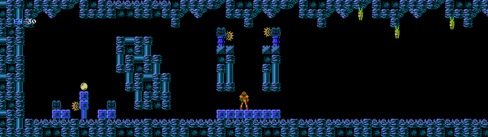

# MetroidNESRecomp

> _This recompilation is a **byproduct of developing
> [nesrecomp](https://github.com/mstan/nesrecomp)** — the games are the proving ground, the framework is the goal.
> **These are in-development previews, not finished ports — expect rough
> edges**, and depth will keep landing over months, not days. My time for any
> one title is limited, so I ask for your patience. Contributions are welcome —
> testing, issues, and PRs to the game or framework all help and will
> accelerate this game's polish. More on the why at:
> [Recomp + AI: 5 Months Later »](https://1379.tech/recomp-ai-5-months-later/)_

A static recompilation of Metroid (NES) using [nesrecomp](https://github.com/mstan/nesrecomp). The original 6502 machine code is translated to C at build time, then compiled to native x64 for direct execution on modern PCs.

**This is NOT an emulator.** The game logic runs as native compiled code. NES hardware (PPU, APU, mapper) is simulated by the runner library.

**You must supply your own Metroid ROM.** No copyrighted game data is included in this repository.

### Which ROM

This build targets **Metroid (USA)** and nothing else:

| | CRC32 (headerless PRG+CHR) | CRC32 (whole `.nes` file) | m1disasm target |
|---|---|---|---|
| **Metroid (USA)** — required | `70080810` | `A2C89CB9` | `NES_NTSC` |
| Metroid (Europe) — **rejected** | `7751588D` | `A591CC24` | `NES_PAL` |

The recompiled C in `generated/` *is* the USA program, so the runner gates on the
headerless CRC32 (`extras.c: game_get_expected_crc32`, `NESRECOMP_GAME_ROM_CRC32`
in `CMakeLists.txt`, and `rom_crc32` in the mod package manifests). The European
ROM differs from the USA one in **every PRG bank** (25394 bytes over 1309 ranges;
its bank-0 sound engine sits 0x30 higher), so it is a different program and this
build will not run it.

A copy of the EU ROM is kept locally as `metroid-eu.nes` (gitignored, like
`metroid.nes`) purely as the reference for a future EU variant of this port — see
[Retargeting to another ROM revision](#retargeting-to-another-rom-revision).

## Status

**Experimental adaptive widescreen support (USA)** is available through the
bundled **Metroid Widescreen** mod. Enable it in the launcher's mod controls and
choose **Fit window**, **16:9**, **21:9**, or **32:9**. The custom renderer shows
adjacent room terrain and follows live window resizing in Fit mode.

Optional mod choices add **Viewport** enemies and item previews, **Expanded**
sprite capacity, and **Reduced slowdown**. Viewport enemies retain their original
distance-based attack triggers. Widescreen is off by default, and each additional
enhancement defaults to **Original**. These features are still experimental;
enemy, projectile, and room-transition coverage remains incomplete.



For the command-line options, tested behavior and remaining limitations, see
[WIDESCREEN.md](WIDESCREEN.md).

**v0.0.1** - Early foundation release.

### What works

- Boot to title screen, start game
- Spawn into the starting area
- Walk, jump, shoot
- Pick up Morph Ball power-up
- Enemy spawning and combat
- Death, Game Over, password screen, and restart cycle (stable across unlimited cycles)
- Long runtime stability (tested 115,000+ frames with no crashes)

### What doesn't work (yet)

- Many areas beyond the starting region are likely missing dispatch table entries, causing enemies, doors, or items to silently not function
- Accuracy against the Mesen oracle is measured but not yet converged: `nes_cosim.py gate1` (recomp determinism) passes byte-identical, and `abram` (RAM vs Mesen over 900 attract frames) reaches 99.65% stack-masked with a residual centred on `NMIStatus`/`FrameCount` and the `FrameCount`-derived RNG. Gameplay may still have subtle behavioral differences
- Some bank-switched code paths may not be discovered by the recompiler's static analysis

This is a foundation for future work. The recompiler and runner are under active development. Each new area explored may require additional `extra_func` entries in `game.toml` or fixes in nesrecomp itself.

## Building

### Prerequisites

- Windows 10/11
- Visual Studio 2022 Build Tools (or full VS 2022)
- CMake 3.20+
- A Metroid (NES) ROM — **USA**, file CRC32 `A2C89CB9` (headerless `70080810`). The
  European ROM is not accepted; see [Which ROM](#which-rom).

### Steps

```bash
git clone https://github.com/mstan/MetroidNESRecomp.git
cd MetroidNESRecomp

# Windows
setup.bat

# Linux / macOS
chmod +x setup.sh && ./setup.sh
```

This initializes the pinned [nesrecomp](https://github.com/mstan/nesrecomp)
submodule and links the Nestopia oracle core.

The generated C files in `generated/` are checked into the repo, so you can
go straight to building the game:

```bash
cmake -S . -B build -G "Visual Studio 17 2022" -A x64
cmake --build build --config Release
```

To regenerate from ROM (optional):

```bash
# Build the recompiler (only needed once, or when nesrecomp changes)
cmake -S nesrecomp/recompiler -B nesrecomp/build/recompiler -G "Visual Studio 17 2022" -A x64
cmake --build nesrecomp/build/recompiler --config Release

# Generate recompiled C code from your Metroid (USA) ROM
nesrecomp/build/recompiler/Release/NESRecomp.exe metroid.nes --game game.toml

# Rebuild the game
cmake --build build --config Release
```

### Symbols and hints come from the disassembly

`disasm/m1disasm` is a submodule of [metroidret/m1disasm](https://github.com/metroidret/m1disasm),
an annotated WLA-DX disassembly that assembles byte-exact copies of **both** ROM
revisions from one source tree (`out/M1_NES_NTSC.nes`, `out/M1_NES_PAL.nes`) and,
via `wlalink -S`, a `.sym` file of labelled addresses for each. Two tools consume it:

- **`tools/gen_symbols.py`** — turns one target's `.sym` into `symbols.sym` (the
  bank-aware symbol overlay `game.toml` points at, so generated functions carry
  their real names) and `metroid_ram.h` (`MET_<Name>` defines for every RAM/MMIO
  label, so `extras.c` and the widescreen renderer never spell an address out).
  Defaults to `NES_NTSC`; it refuses to run if the ROM body does not match the
  target it was asked for.
- **`tools/extract_metroid_data_regions.py`** — walks `disasm/m1disasm/SRC` and
  emits the `[[data_region]]` blocks that keep the recompiler from mistaking
  tables for code. `--target` selects which `.if BUILDTARGET` branch applies.

### Retargeting to another ROM revision

`game.toml`'s hints are raw addresses, so they are revision-specific.
**`tools/migrate_hints.py`** moves them by *label name* rather than by hand: it
reads the old and new `.sym`, rewrites `[functions]`, `[[data_region]]`,
`[[inline_dispatch]]`, `[[stack_bail_func]]`, `[[cond_bail_func]]`,
`[[merge_range]]` and `[[mod_function_hook]]`, and drops anything it cannot
resolve (reporting each one). An address with no label of its own is recovered
only when the move can be *proven*: the span between the two surrounding matched
labels must be the same length in both builds, and — given `--old-rom/--new-rom` —
must also hold the same bytes, the same relocated operands, or the same 6502
opcode stream. To retarget this repo at the European ROM:

```bash
python tools/gen_symbols.py --target NES_PAL --rom metroid-eu.nes
python tools/extract_metroid_data_regions.py --target NES_PAL   # replaces [[data_region]]
python tools/migrate_hints.py --toml game.toml \
    --old-sym disasm/m1disasm/out/M1_NES_NTSC.sym \
    --new-sym disasm/m1disasm/out/M1_NES_PAL.sym \
    --old-rom metroid.nes --new-rom metroid-eu.nes \
    --skip data_region --out game.toml --report migration_report.txt
```

then update the CRC32 in `extras.c`, `CMakeLists.txt` and the mod manifests, and
regenerate. The tool is game-agnostic — any nesrecomp title with per-revision
`.sym` files can use it.

## Project Structure

| File | Purpose |
|------|---------|
| `game.toml` | Recompiler configuration (dispatch hints, data regions, extra functions) — **NTSC/USA addresses** |
| `extras.c` | Game-specific runner hooks (frame callbacks, password save system, ROM CRC gate) |
| `symbols.sym` | Bank-aware symbol overlay, generated from the disassembly (do not edit) |
| `metroid_ram.h` | `MET_<Name>` RAM/MMIO defines, generated from the disassembly (do not edit) |
| `metroid_ws*.c/h` | Opt-in widescreen mod: gating, function hooks, compositor, room decoder |
| `mods/` | Declarative mod packages + their trusted plugin registration |
| `recomp_stack.h/c` | Recompiled function call stack tracking |
| `watchdog.h/c` | Frame timeout detection |
| `generated/metroid_full*.c` | Auto-generated recompiled game code (do not edit) |
| `generated/metroid_dispatch.c` | Auto-generated dispatch table (do not edit) |
| `disasm/m1disasm/` | Annotated WLA-DX disassembly (git submodule) — source of symbols and data regions |
| `tools/gen_symbols.py` | `.sym` → `symbols.sym` + `metroid_ram.h` |
| `tools/extract_metroid_data_regions.py` | disassembly → `[[data_region]]` blocks |
| `tools/migrate_hints.py` | move `game.toml` addresses between ROM revisions by label name |
| `nesrecomp/` | Recompiler + runner framework (git submodule) |

## How It Works

The nesrecomp recompiler statically analyzes the ROM, discovers functions via BFS from the NMI/RESET/IRQ vectors, and translates each 6502 instruction to equivalent C code. JSR becomes a direct C function call, branches become gotos, and the 6502 stack is maintained as real RAM at `g_ram[0x100+S]`.

Metroid uses the MMC1 mapper with 8 PRG banks. Bank 7 is fixed (always mapped at $C000-$FFFF) and contains the main game loop, NMI handler, and core routines. Banks 0-6 are switchable and contain area-specific code. The recompiler handles bank switching via `call_by_address()` runtime dispatch.

## License

The recompiler framework (nesrecomp submodule) and all game-specific code in this repository are provided as-is for educational and research purposes. No game ROM data is included. You must supply your own legally obtained copy of Metroid (USA).

---

<p align="center">
  <sub><b>R.A.I.D. — Retro AI Development</b> · a Discord for AI-assisted retro reverse-engineering, decomp &amp; recomp</sub>
</p>

<p align="center">
  <a href="https://discord.gg/Ad9BwSzctP"></a>
</p>
